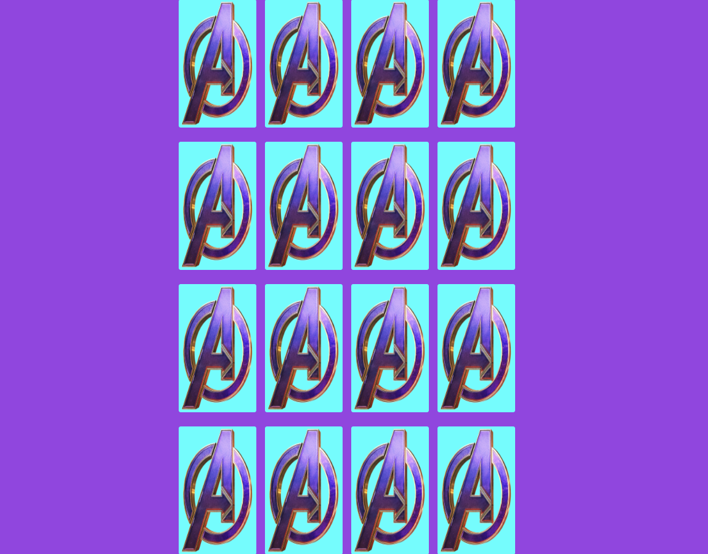

# Memory

## Challenges I Faced?

I had difficulty understanding how to put the underlying logic of a memory game into JavaScript. Specifically with the validation aspect, having two of the same cards picked by the user stay right side up.

## How Did I Over Come Those Challenges? 

After reaching the limit of my own capability to program, I went back to the drawing board, I collaborated with my peers to better understand different ways to approach this problem. I wrote out what I wanted to happen step-by-step on a whiteboard. Once I had a general idea of how the program should work I began to take the logic that I wrote out in common english and translated it into JavaScript bit by bit. By leveraging platforms like Google, YouTube, MDN docs, Stackoverflow, GitHub, online courses, bootcamps and reference guides I was able to find the proper JavaScript methods and functions needed to complete the task and I programmed the game accordingly.

## What Did I Learn? 

* Received a deeper understanding of functions, conditionals, loops, arrays
* Received a deeper understanding on how to properly sequence JavaScript statements
* How to change the DOM based on application state 
* How to create CSS animations
* How to use icon fonts effectively
* How to use JavaScript templates
* How to use JavaScript routing to show HTML based on the URL

